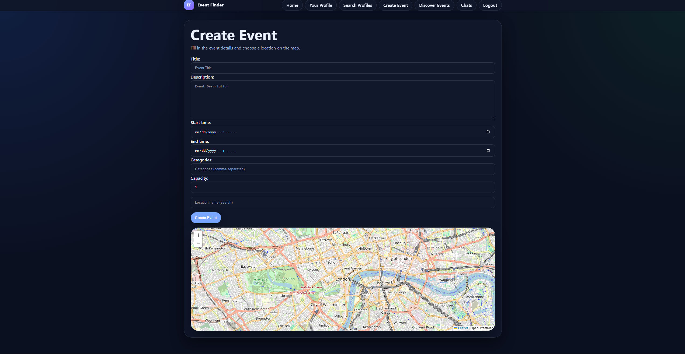
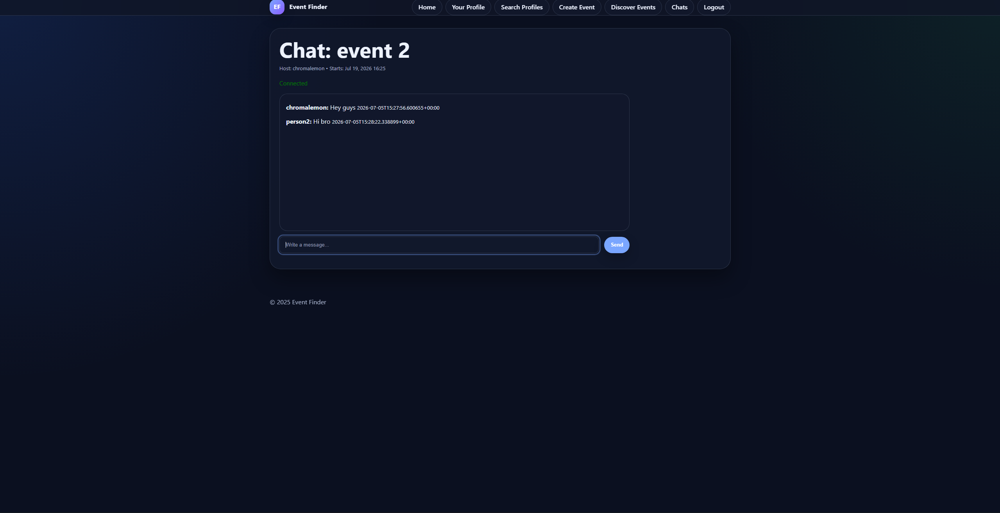
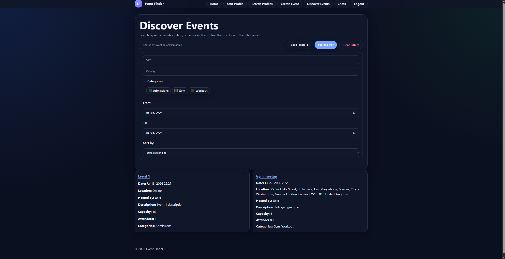

# Event Finder Overview

**Event Finder** is a full-stack Django web application that enables users to discover, create and manage events, with integrated real-time group chats using Django Channels and WebSockets.

**Key Capabilities**
- **Event Discovery and Participation** - Browse a global list of events created by other people. Apply various filters and search by keywords to narrow search.
- **Map Interface** - Interact with an on-screen map to pinpoint event location.
- **Event Creation** - Create custom events at any location, adding descriptions, images, and categories.
- **Per-Event Real-time Chat** - Access an attendee-only live group chat, hosted privately for every event.
- **Secure User Auth** - Create and manage an account which is stored securely. Upload a profile image and give yourself a description.

## Screenshots

 **Event Creation Page**

<picture>
 <source media="(prefers-color-scheme: dark)" srcset="docs/dark_create.png">
 <source media="(prefers-color-scheme: light)" srcset="docs/light_create.png">
 
</picture>

**Event Chat Page**

<picture>
 <source media="(prefers-color-scheme: dark)" srcset="docs/dark_chat.png">
 <source media="(prefers-color-scheme: light)" srcset="docs/light_chat.png">
 
</picture>

**Event Discovery Page**

<picture>
 <source media="(prefers-color-scheme: dark)" srcset="docs/dark_list.png">
 <source media="(prefers-color-scheme: light)" srcset="docs/light_list.png">
 
</picture>


## Tech Stack

- Python
- Django
- Django Channels
- JavaScript
- HTML/CSS
- Docker
- Redis

## Prerequisites

- Docker
- Docker Compose

## Installation & Running

Clone the repository:

```bash
git clone https://github.com/chromalemon/event-finder 
cd event-finder 
```

Make the scripts executable:

```bash
chmod +x setup.sh run.sh test.sh
```

Run the setup script:

```bash
./setup.sh
```

Start the application:

```bash
./run.sh
```

The application will then be available at:

```
http://127.0.0.1:8000
```

## Stopping redis

When you are finished:

```bash
docker compose down
```

## Local Environment

If you want to customize the container settings, copy [.env.example](.env.example) to `.env` and adjust the values there.
